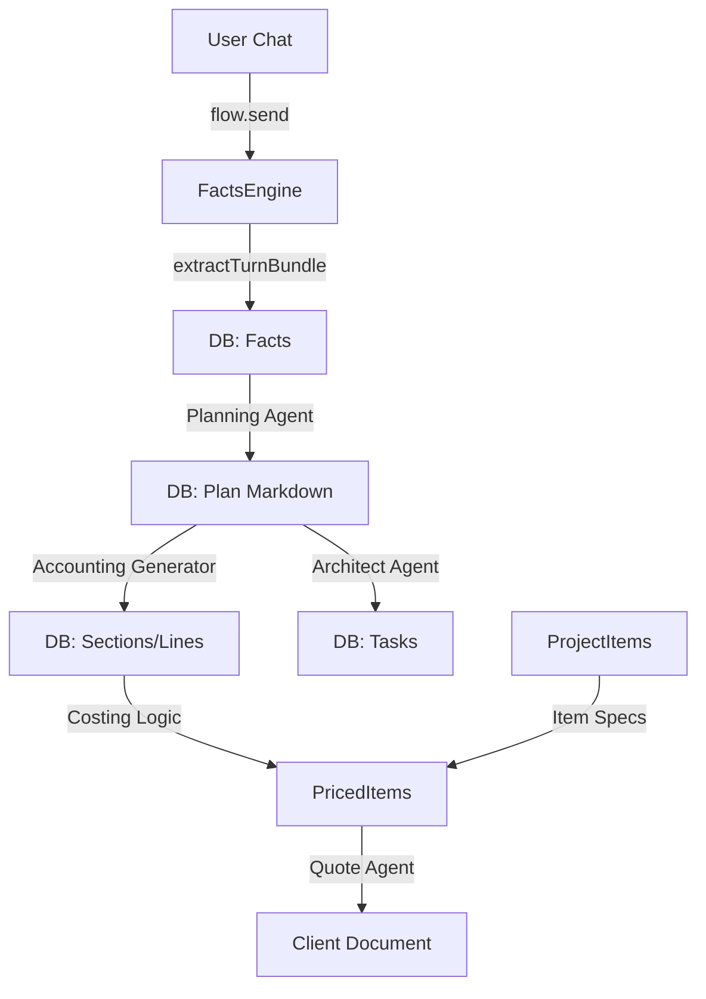

# AgenticEshet Process Flow & Architecture

This document details the functional architecture of the AgenticEshet application, mapping **User Actions** to **Code Execution** and explaining the data transformations that occur between the Planning, Tasks, Accounting, and Quotes modules.

---

## 1. Core Data Pipelines (Background Processes)

Before understanding the tabs, it is crucial to understand how the system "learns" and "remembers".

### A. The "Facts Engine" (Automatic Learning)
**Trigger:** This process runs automatically whenever a user sends a message in any chat interface or an agent generates a response (only when `factsEnabled=true`, which is disabled by default in canonical projects).

1.  **User Action**: User sends a chat message (e.g., "The venue is 500sqm and we need a red carpet").
2.  **Code Trigger**: `convex/agents/flow.ts` -> `flow:send` action.
    -   After the LLM replies, the code calls `internal.turnBundles.createFromTurn`.
3.  **Backend Process** (`convex/factsV2.ts`):
    -   **Step 1: Ingestion**: The chat turn (User + Assistant text) is saved as a `TurnBundle`.
    -   **Step 2: Processing Queue**: The `extractTurnBundle` action is triggered.
    -   **Step 3: LLM Extraction**: An LLM (GPT-4o) analysis the text using the `FactAtomSchema`. It looks for:
        -   **Scope**: Is this about the whole project or a specific item?
        -   **Category**: Schedule, Budget, Constraint, Preference.
        -   **Content**: "Venue size is 500sqm".
    -   **Step 4: Storage**: Extracted facts are stored in `factAtoms`.
    -   **Step 5: Vectorization**: Facts are embedded into `factEmbeddings`, allowing agents to query "What do we know about the venue?" later.
4.  **Facts Disabled Path**: When `factsEnabled=false`, ingestion writes summaries into `knowledgeLogEntries` and no new fact rows are created.

### B. The "Knowledge Base" (Artifact Storage)
**Trigger**: Uploading a PDF or approving a plan/quote.

1.  **User Action**: User clicks "Upload" in chat, or processes a document.
2.  **Code Trigger**: `convex/knowledge.ts` -> `ingestArtifact`.
3.  **Backend Process**:
    -   **Parsing**: The file text is extracted (via `pdf-parse` or similar if needed, or raw text).
    -   **Enhancement**: An LLM "Enhancer" generates a summary, tags, and extracts metadata (Client Name, Topics).
    -   **Chunking**: The text is split into semantic chunks (overlapping windows of ~1000 chars).
    -   **Embedding**: Each chunk is converted to a vector and stored in `knowledgeChunks` for similarity search.

### C. Canonical Elements + Draft Approval
**Trigger:** A user edits Tasks or Accounting while Elements are canonical, or an agent proposes changes.

1.  **Draft Writes**: Changes go into `revisions` and `revisionChanges` via `revisions.patchElement` or `revisions.upsertChange` (no immediate task/material/work writes).
2.  **Approval**: `revisions.approve` validates conflicts, applies patch ops or snapshots, and writes a new `elementVersions.snapshot`.
3.  **Projection**: `projections.rebuild` generates `tasks`, `materialLines`, and `workLines` from the canonical snapshot.
4.  **Agent Context Order**: Element snapshot -> Current Knowledge -> Chat history.

---

## 2. Interaction Flows by Tab

### Tab 1: Planning / Ideation / Solutioning
**Goal**: To interactively develop the project strategy and generate a structured Plan.

#### Feature: Agent Chat
*   **User Action**: clicks "Generation Chat" -> Types message -> Clicks Send.
*   **Trigger**: `api.agents.flow.send` (Action).
*   **Process**:
    1.  **Context Assembly** (`internal.factsV2.getFactsContext`): The system gathers relevant Facts, Knowledge Chunks, and current Item summaries.
    2.  **Prompt Construction**: Builds a massive context prompt ("You are Agent A... here is what we know...").
    3.  **Streaming Response**: Calls OpenAI to stream the response to the UI.
    4.  **Side Effect**: The conversation is fed back into the **Facts Engine** (Process A above).

#### Feature: Current State (The "Plan")
*   **User Action**: User edits the text in the "Current State" panel -> Clicks "Save" (or auto-save).
*   **Trigger**: `api.flowWorkspaces.saveText`.
*   **Significance**: This Markdown text is the "Source of Truth" for the downstream agents.
*   **User Action**: Clicks "Submit State" / "Generate Elements".
*   **Trigger**: `api.agents.flow.generateItemUpdate` (Action).
*   **Process**:
    1.  **Parsing**: The LLM reads the Markdown plan.
    2.  **Schema Extraction**: It extracts an `ItemSpecV2` structure (JSON) containing Identity, Breakdown (Subtasks, Materials, Labor), and State.
    3.  **Sync**: This JSON is applied to the `projectItems` table, updating the central Elements list.

---

### Tab 2: Accounting (Budget & Costing)
**Goal**: transform the Plan into a financial budget.

#### Feature: Auto-Generate Accounting
*   **User Action**: User clicks **"Generate from Plan"** button.
*   **Trigger**: `api.agents.accountingGenerator.run` (Action).
*   **Process (LLM-Based)**:
    1.  **Fetch**: Reads the "Approved Plan" (Markdown) from `plans` table.
    2.  **LLM Generation**: Prompts GPT-4o with the `AccountingFromPlanSchema`.
        -   *Instruction*: "Analyze this plan and list all required budget sections (e.g., 'Construction', 'Catering'). For each section, list implied materials and labor roles."
    3.  **Application**: The standardizing response is passed to `internal.agents.accountingGenerator.applyGeneratedAccounting`.
    4.  **Database Updates**:
        -   Creates `sections` (groups of costs).
        -   Creates `materialLines` (e.g., "Wood", "Drinks").
        -   Creates `workLines` (e.g., "Carpenter", "Barista").
        -   **Backfilling**: If the plan mentions an item that doesn't exist, it creates a new `projectItem`.

#### Feature: Auto-Estimation
*   **User Action**: User clicks **"Auto-Estimate Project"** button.
*   **Trigger**: `api.agents.estimator.estimateProject` (Action).
*   **Process**:
    1.  **Scanning**: Iterates through all cost lines with 0 price.
    2.  **LLM Estimation**: Asks the LLM "Estimate the cost of 50 sheets of plywood in Tel Aviv in ILS".
    3.  **Update**: Updates the `cost` field in `materialLines`.

---

### Tab 3: Tasks (Execution & Gantt)
**Goal**: Break down the project into actionable steps with dependencies.

#### Draft Editing (Canonical Elements)
*   **User Action**: User toggles "Edit tasks" with `elementsCanonical=true`.
*   **Trigger**: `api.revisions.createDraft` and `api.revisions.patchElement`.
*   **Process**: Changes are captured as patch ops on the element snapshot; tasks table updates only after `revisions.approve`.

#### Feature: Architect Agent (Task Generation)
*   **User Action**: User clicks **"Auto-Generate from Plan"** button.
*   **Trigger**: `api.agents.architect.run` (Action).
*   **Process (LLM-Based)**:
    1.  **Context**: Fetches Project Context, Plan, Accounting Sections, and Existing Items.
    2.  **LLM Prompt**: "Break this plan down into a granular task list. For each task, assign a duration, a dependency (what must happen first?), and link it to an Accounting Section."
    3.  **Schema Enforcement**: Uses `TaskBreakdownSchema` to ensure strict JSON output.
    4.  **Save Mutation** (`saveTasks`):
        -   **Resolution**: Matches string names ("Construction") to ID (`section_123`).
        -   **Deduping**: Checks if a similar task already exists.
        -   **Insertion**: Inserts into `tasks` table.

#### Feature: Dependency Refining
*   **User Action**: User clicks **"Refine Tasks"**.
*   **Trigger**: `api.agents.taskRefiner.run`.
*   **Process**:
    1.  **Focus**: Specifically looks at `tasks` with missing dependencies or unrealistic durations.
    2.  **Optimization**: The LLM re-evaluates the schedule logic to ensure the Gantt chart flows correctly (e.g., "You can't paint walls before building them").

---

### Tab 4: Quotes (Client Facing)
**Goal**: Produce a sellable PDF/document gathering all costs and specs.

#### Canonical Projection Sync
*   When `elementsCanonical=true`, quote generation triggers a projections rebuild so material/work lines reflect the latest element snapshots.

#### Feature: Agent-Guided Quote
*   **User Action**: User types instructions (e.g., "Make it friendly, verify we have a 20% margin") -> Clicks **"Generate Draft with AI"**.
*   **Trigger**: `api.agents.quote.run` (Action).
*   **Process**:
    1.  **Aggregation**:
        -   Fetches **Elements** (Visual descriptions).
        -   Fetches **Accounting** (Actual costs calculated in Tab 2).
        -   Fetches **Margins** (Project policy).
    2.  **System Prompt**: "You are a sales agent. Write a quote using this specific pricing data. Do not hallucinate prices."
    3.  **Drafting**: Generates a JSON structure `QuoteAgentResultSchema` (includes `markdown` content and `lineByLine` breakdown).
    4.  **Saving**: Saves to `quotes` table.

#### Feature: Manual Wizard
*   **User Action**: User selects checks boxes next to Items/Sections -> Clicks **"Create quote version"**.
*   **Trigger**: `api.quotes.createFromWizard` (Mutation - Deterministic).
*   **Process**:
    -   **Calculation**: Sums up the selected "Client Price" values from the Accounting engine.
    -   **Generation**: Creates a static Quote record. No LLM involved here.

---

## Summary of "Triggers" type
1.  **Actions (`action`)**: These run Node.js code and usually call LLMs (OpenAI). They are asynchronous and can take time.
    -   Examples: `flow.send`, `architect.run`, `accountingGenerator.run`.
2.  **Mutations (`mutation`)**: These are atomic database transactions. They are fast, deterministic, and modify the DB.
    -   Examples: `saveTasks`, `updateSection`, `createFromWizard`.
3.  **Queries (`query`)**: detailed read-only operations that power the UI.
    -   Examples: `getProjectAccounting`, `listSidebarTree`.

## Data Flow Diagram

